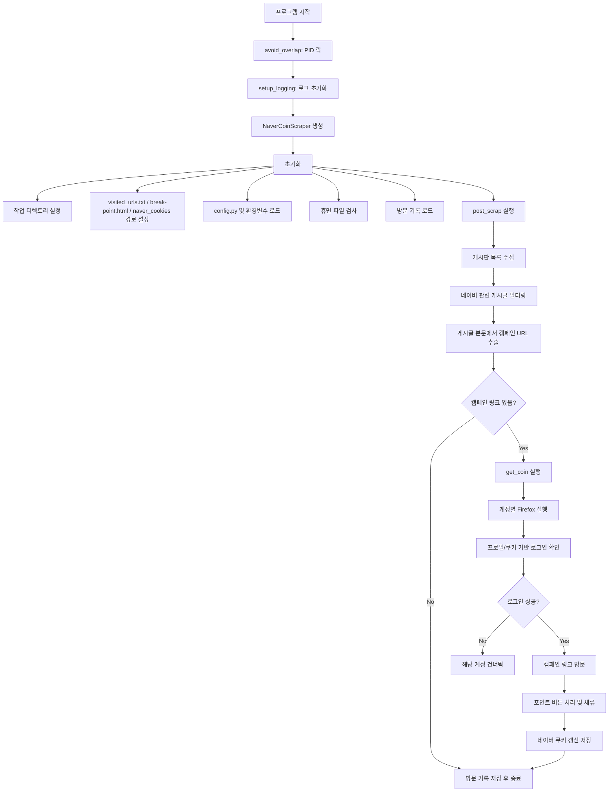
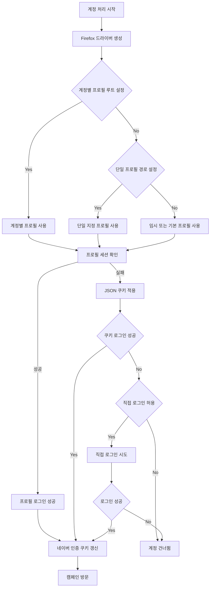
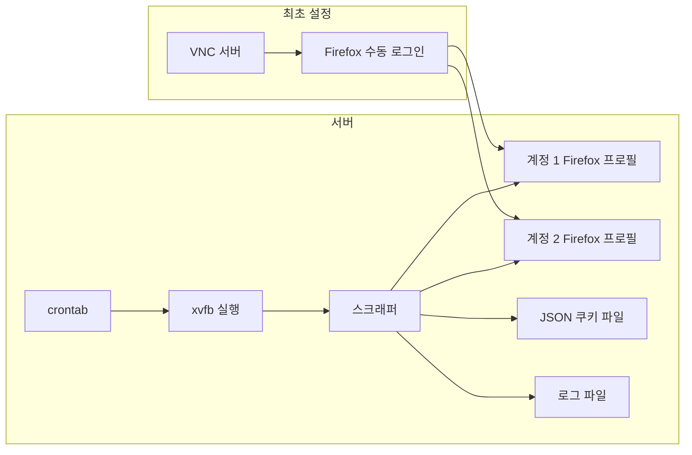
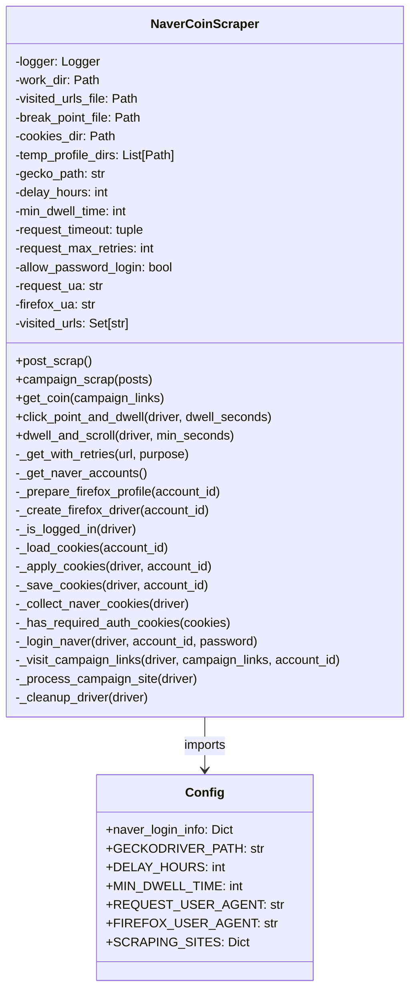
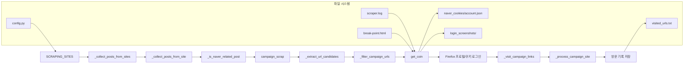
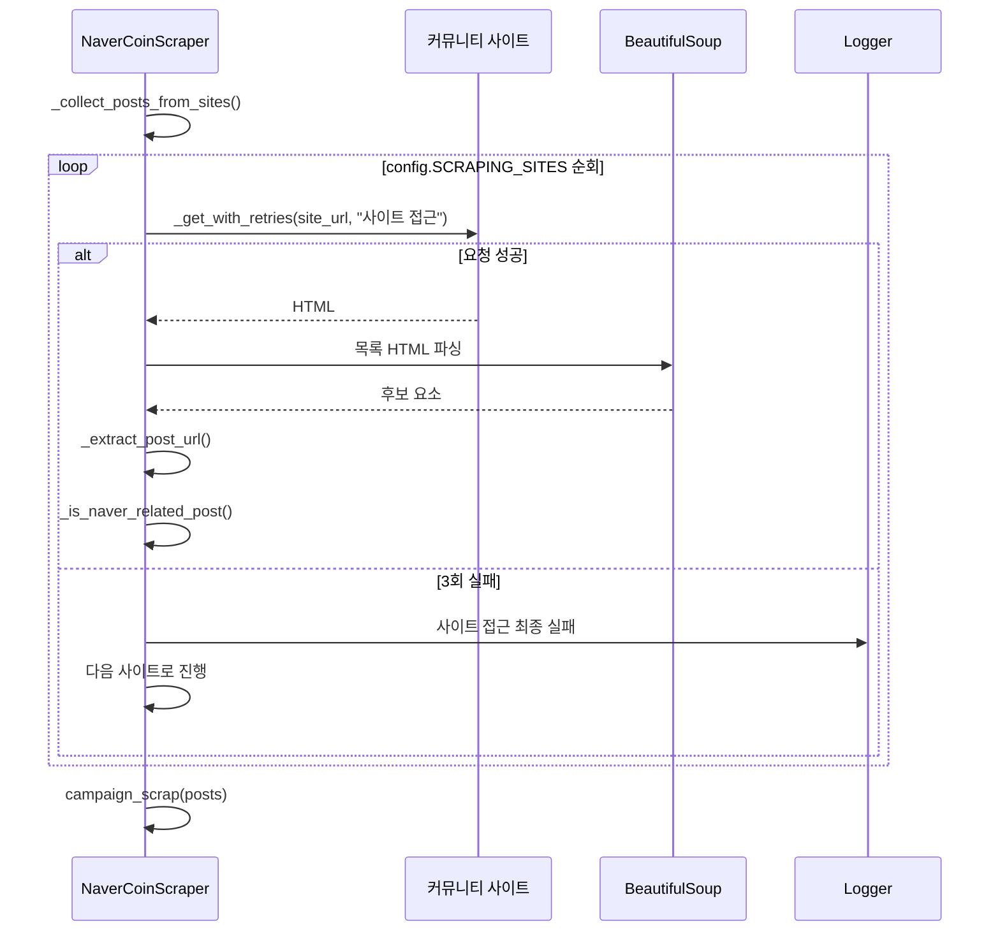
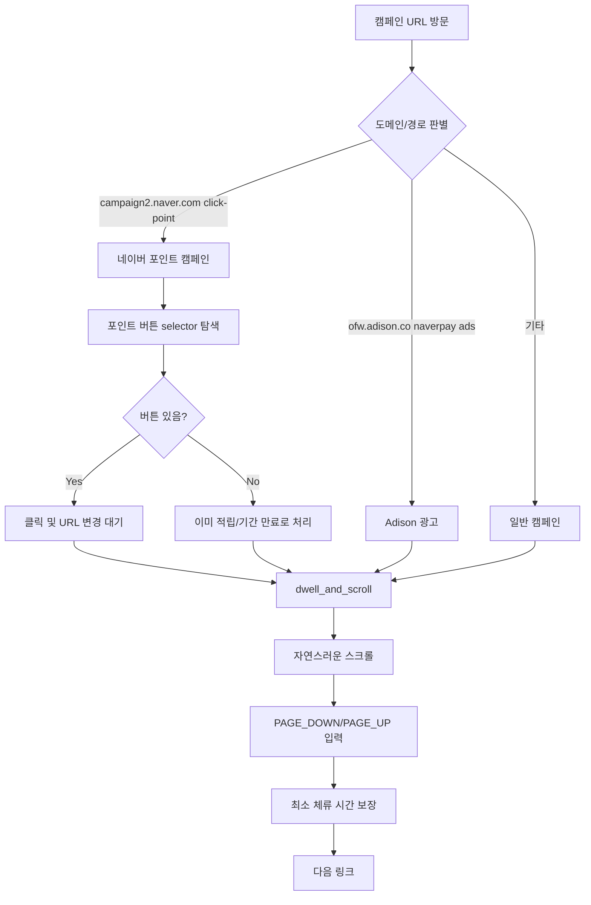
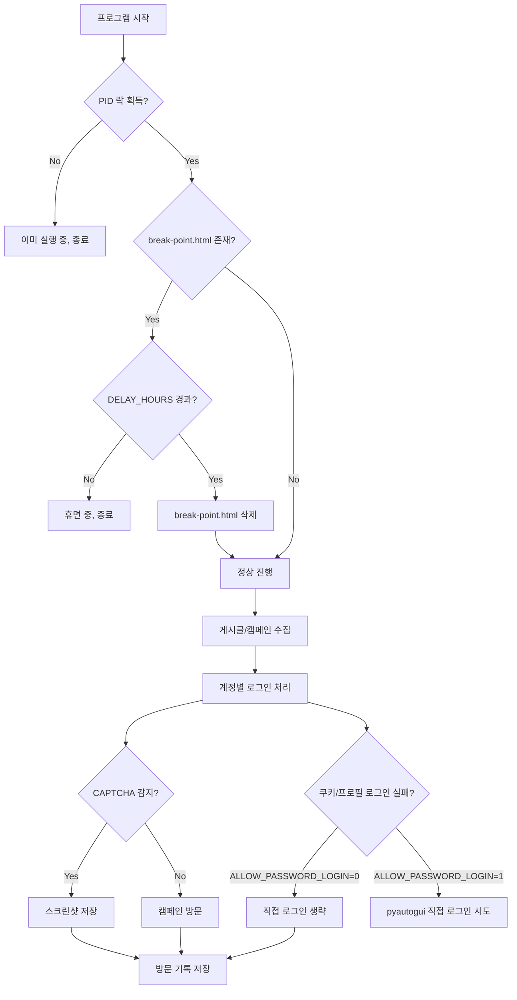

# NCC 아키텍처 다이어그램

이 문서는 현재 `run_firefox.py` 기준의 실행 구조를 설명합니다. 핵심 인증 방식은 계정별 Firefox 프로필 세션을 우선 사용하고, 보조 수단으로 `naver_cookies/<account>.json` 쿠키를 적용하는 방식입니다.

## 전체 실행 플로우



## 인증 및 세션 플로우



## 서버 운영 구조



서버 실행 예시는 다음 형태입니다.

```bash
FIREFOX_PROFILE_ROOT=/free/home/naver/firefox-profiles \
MOZ_DISABLE_CONTENT_SANDBOX=1 \
xvfb-run -a /usr/local/pyenv/versions/3.12.1/bin/python run_firefox.py
```

## 클래스 구조



## 데이터 플로우



## 게시글 수집 플로우



## 캠페인 처리 플로우



## 에러 처리 및 보호 장치



## 주요 운영 포인트

- `FIREFOX_PROFILE_ROOT`가 설정되면 `FIREFOX_PROFILE_ROOT/<account_id>` 프로필을 계정별로 사용합니다.
- Firefox 프로필 세션이 가장 먼저 확인됩니다. 성공하면 JSON 쿠키 주입은 수행하지 않습니다.
- JSON 쿠키는 보조 수단입니다. `NID_AUT`, `NID_SES`가 없는 쿠키는 저장하지 않아 기존 인증 쿠키 파일을 덮어쓰지 않습니다.
- `ALLOW_PASSWORD_LOGIN` 기본값은 `0`입니다. 쿠키/프로필 로그인이 실패해도 직접 비밀번호 로그인으로 넘어가지 않아 CAPTCHA 루프를 줄입니다.
- GUI 없는 서버에서는 `xvfb-run`으로 자동 실행하고, 최초 프로필 로그인은 VNC에서 수행합니다.
- Cron 실행 시간에는 VNC에서 같은 Firefox 프로필을 열어두면 안 됩니다. 프로필 잠금 때문에 Firefox 실행이 실패하거나 세션 저장이 꼬일 수 있습니다.
