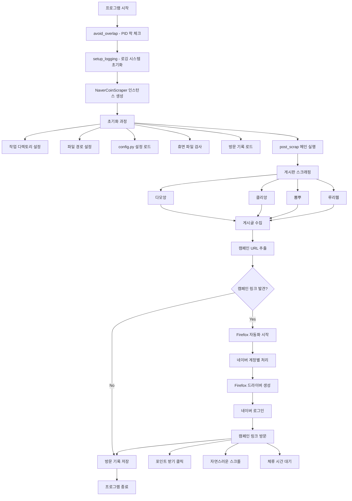
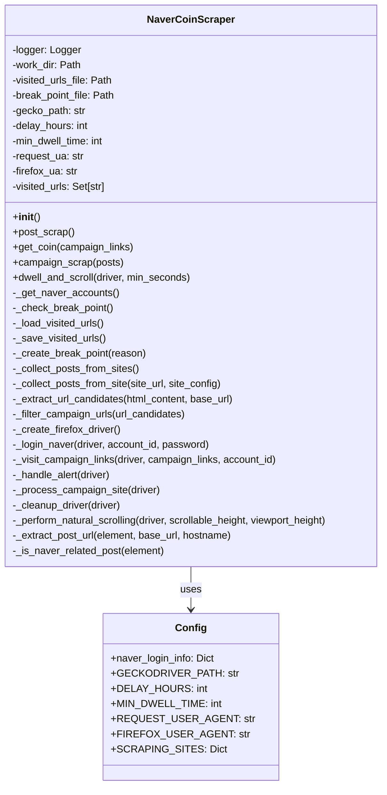
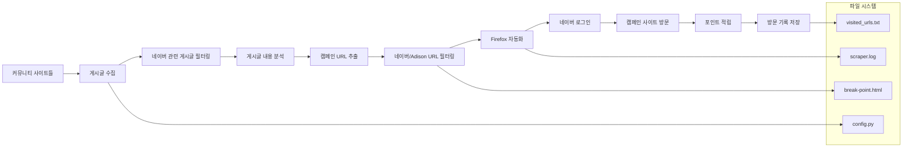
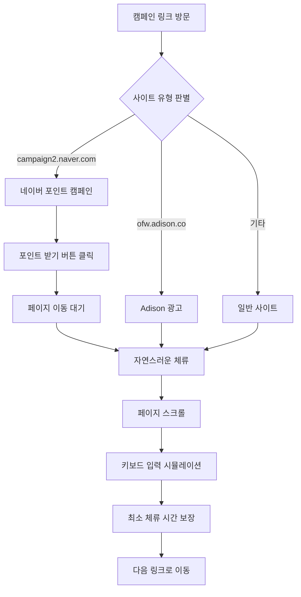
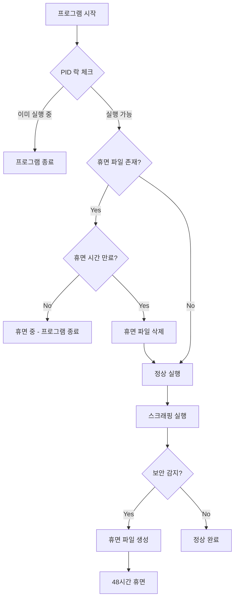
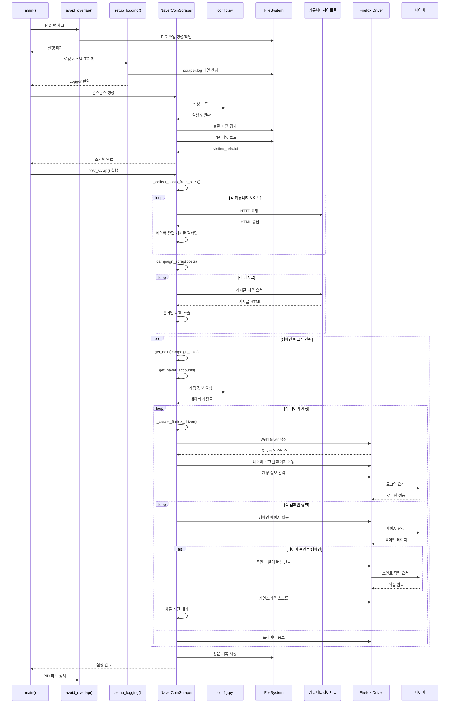
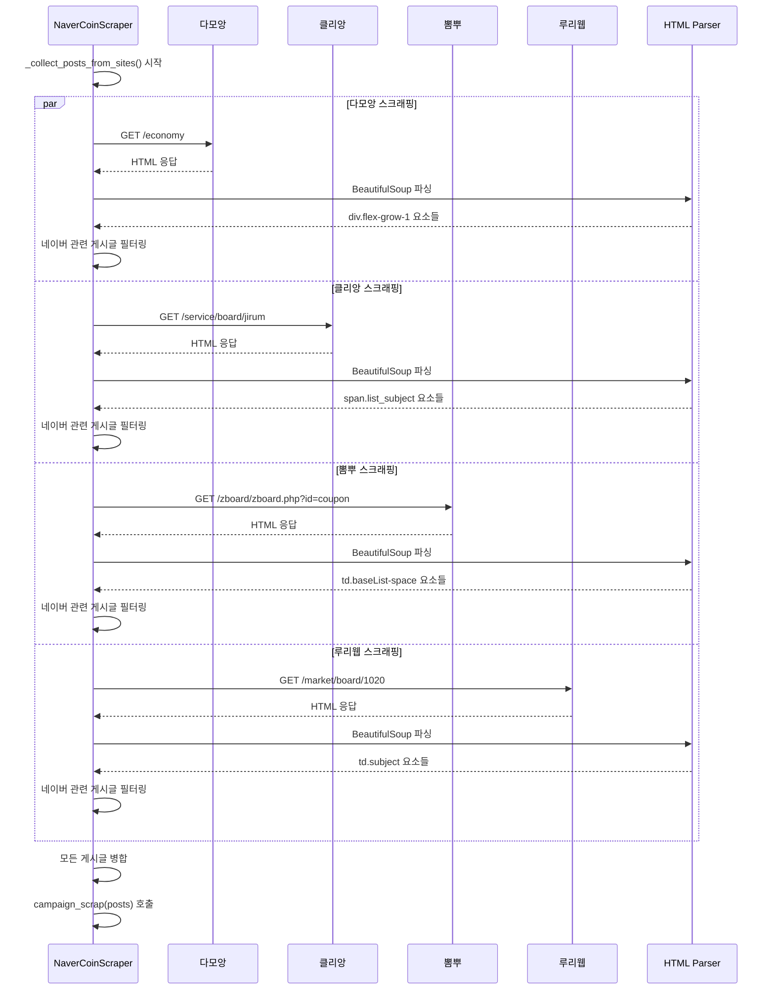
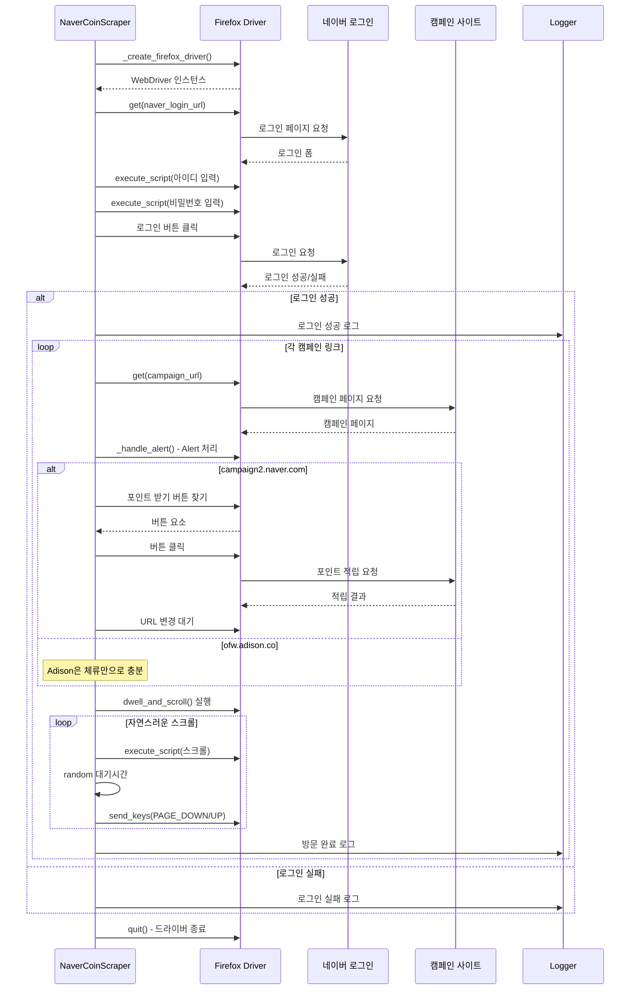
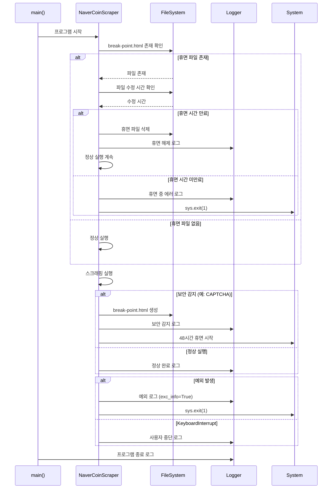

# NCC (네이버 포인트 스크래퍼) 아키텍처 다이어그램

## 전체 시스템 플로우

## 클래스 구조 다이어그램

## 데이터 플로우 다이어그램

## 사이트별 처리 플로우

## 에러 처리 및 보안 플로우

이 다이어그램들은 코드의 전체적인 구조와 실행 흐름을 시각적으로 보여줍니다. 각 다이어그램은 다른 관점에서 시스템을 설명합니다:

1. **전체 시스템 플로우**: 프로그램의 전체 실행 순서
2. **클래스 구조**: 객체지향 설계 구조
3. **데이터 플로우**: 데이터가 어떻게 처리되는지
4. **사이트별 처리**: 각 캠페인 사이트별 처리 방식
5. **에러 처리**: 보안 및 예외 상황 대응

필요하시면 특정 부분을 더 자세히 설명하거나 다른 관점의 다이어그램도 만들어드릴 수 있습니다!

## 시퀀스 다이어그램

### 1. 전체 실행 시퀀스

### 2. 게시글 스크래핑 시퀀스

### 3. Firefox 자동화 시퀀스

### 4. 에러 처리 및 보안 시퀀스

이제 총 4개의 시퀀스 다이어그램이 추가되었습니다:

1. **전체 실행 시퀀스** - 프로그램 전체 실행 흐름
2. **게시글 스크래핑 시퀀스** - 다중 사이트 병렬 스크래핑
3. **Firefox 자동화 시퀀스** - 브라우저 자동화 상세 과정
4. **에러 처리 및 보안 시퀀스** - 예외 상황 처리 흐름

각 시퀀스는 시간 순서대로 객체 간의 상호작용을 보여주어 코드의 동작 방식을 더 명확하게 이해할 수 있습니다! 🎯